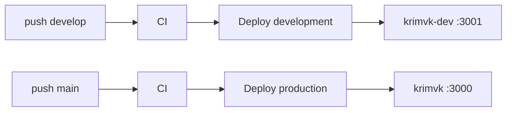

# CI/CD: автодеплой dev + prod

## Схема

| Ветка | Окружение | Каталог на VPS | PM2 | Порт |
|-------|-----------|----------------|-----|------|
| `main` | production | `/var/www/krimvk` | `krimvk` | 3000 |
| `develop` | development | `/var/www/krimvk-dev` | `krimvk-dev` | 3001 |



## Workflows

- [`.github/workflows/ci.yml`](../.github/workflows/ci.yml) — на PR и push в `main` / `develop`: `npm ci`, test, build.
- [`.github/workflows/deploy.yml`](../.github/workflows/deploy.yml) — после push:
  - `main` → SSH → `scripts/deploy-vps.sh` в prod-каталоге
  - `develop` → SSH → тот же скрипт в dev-каталоге

Ручной деплой: **Actions → Deploy VPS → Run workflow** → выбрать `production` или `development`.

Быстрый старт: [VPS_QUICKSTART.md](./VPS_QUICKSTART.md)

## Первичная настройка VPS

```bash
# Каталоги
sudo mkdir -p /var/www/krimvk /var/www/krimvk-dev
sudo chown -R krimvk:krimvk /var/www/krimvk /var/www/krimvk-dev

# Клонирование (под пользователем krimvk)
sudo -u krimvk -H bash -lc 'cd /var/www/krimvk && git clone <REPO_URL> .'
sudo -u krimvk -H bash -lc 'cd /var/www/krimvk-dev && git clone <REPO_URL> . && git checkout develop'

# Env на сервере (не в git)
cp /var/www/krimvk/.env.example.vps /var/www/krimvk/.env
cp /var/www/krimvk-dev/.env.example.dev /var/www/krimvk-dev/.env.dev

# Nginx: nginx.conf.example или nginx.conf.ip-first.example
# PM2 после первого деплоя: pm2 list
```

Секреты GitHub: [GITHUB_SECRETS.md](./GITHUB_SECRETS.md).

## Ежедневная работа

1. Feature-ветка → PR в `develop`.
2. Merge в `develop` → автодеплой на dev (проверка на `dev.yourdomain.ru` или `http://IP:8080`).
3. PR `develop` → `main` → автодеплой prod.

Локально: `npm run dev` (деплой не затрагивает).

## Откат

См. [PRODUCTION_RUNBOOK.md](./PRODUCTION_RUNBOOK.md) — rollback `.next` + `pm2 restart`.

На dev — тот же процесс в `/var/www/krimvk-dev`, процесс `krimvk-dev`.

## Self-hosted runner (рекомендуется для стабильности в РФ)

GitHub-hosted runners находятся за рубежом; SSH-деплой обычно работает, но при нестабильном доступе к GitHub удобнее runner **на том же VPS**.

### Установка

1. GitHub → **Settings → Actions → Runners → New self-hosted runner** → Linux x64.
2. На VPS под пользователем `krimvk` (или отдельным `github-runner`):

```bash
mkdir -p ~/actions-runner && cd ~/actions-runner
curl -o actions-runner-linux-x64.tar.gz -L https://github.com/actions/runner/releases/download/v2.321.0/actions-runner-linux-x64-2.321.0.tar.gz
tar xzf actions-runner-linux-x64.tar.gz
./config.sh --url https://github.com/<ORG>/<REPO> --token <TOKEN_FROM_GITHUB>
```

3. Установка как сервис:

```bash
sudo ./svc.sh install github-runner
sudo ./svc.sh start
```

4. В workflow замените `runs-on: ubuntu-latest` на:

```yaml
runs-on: self-hosted
```

(для job deploy и при желании CI).

### Плюсы

- Деплой не зависит от зарубежного runner до SSH.
- Сборка может идти локально на VPS (быстрее повторные деплои).

### Минусы

- Нужно обновлять runner и следить за безопасностью сервера.
- Runner имеет доступ к коду и может запускать deploy-скрипты — изолируйте пользователя.

## Связанные документы

- [GITHUB_SECRETS.md](./GITHUB_SECRETS.md)
- [PRODUCTION_RUNBOOK.md](./PRODUCTION_RUNBOOK.md)
- [GO_LIVE_CHECKLIST.md](./GO_LIVE_CHECKLIST.md)
- [NIC_RU_GO_LIVE_90MIN.md](./NIC_RU_GO_LIVE_90MIN.md)
